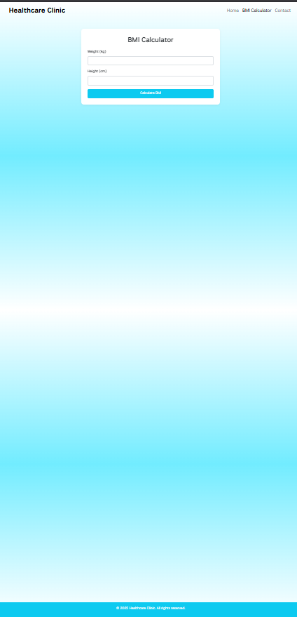

# 🏥 Healthcare Clinic Website


> A responsive, modern healthcare clinic website built with **HTML5**, **Bootstrap 5**, **JavaScript**, and **CSS3**, featuring a BMI calculator, contact form with email functionality, scroll animations, and a clean UI for patient interaction.

---

## 🔗 Live Demo
👉 [View Website](#)  
*(Replace with your Netlify/GitHub Pages link once deployed)*

---

## 📋 Features

- ✅ **Responsive Design** (Mobile-first with Bootstrap 5)
- 🎞️ **Hero Carousel** with clean transitions
- 🧮 **BMI Calculator** using JavaScript
- 📩 **Contact Form** with Formspree email integration
- 🌀 **Scroll-triggered Animations** (AOS library)
- 💡 **Loading animation** on page load
- 🌐 **Deployed Online** with fast performance
- 🎨 Custom styling using **CSS3 + Google Fonts**

---

## 📂 Project Structure

```
/project-root
│
├── index.html          # Homepage with hero section & services
├── bmi.html            # BMI calculator page
├── contact.html        # Contact/appointment form
│
├── style.css           # Custom CSS styles
├── script.js           # JS logic for animations & BMI
├── /img                # Image assets (carousel etc.)
└── README.md           # You're reading it 😉
```

---

## 🛠️ Technologies Used

- **HTML5**
- **CSS3**
- **Bootstrap 5**
- **JavaScript (Vanilla)**
- **AOS.js** (Animate on Scroll)
- **Formspree.io** (Contact form integration)
- **Google Fonts (National Park)**

---

## 📧 Contact Form Integration

This website uses [Formspree.io](https://formspree.io/) for handling form submissions without a backend.

```html
<form action="https://formspree.io/f/your_form_id" method="POST">
  ...
</form>
```
👉 Replace `your_form_id` with your actual Formspree endpoint.

---

## 🚀 Getting Started (Local)

To run this project locally:

```bash
git clone https://github.com/your-username/healthcare-clinic-website.git
cd healthcare-clinic-website
open index.html  # or open in VSCode + Live Server
```

---

## 📸 Screenshots

| Home Page (Carousel) | BMI Calculator | Contact Form |
|----------------------|----------------|--------------|
|  |  |  |

---

## ✨ Credits

Created by [Your Name]  
A frontend web developer passionate about clean UI, accessibility, and user-centered design.

---

## 📄 License

This project is open-source and available under the [MIT License](LICENSE).
